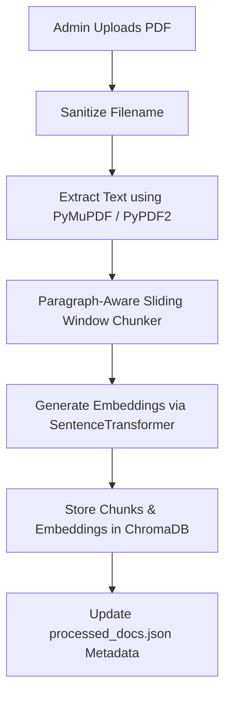
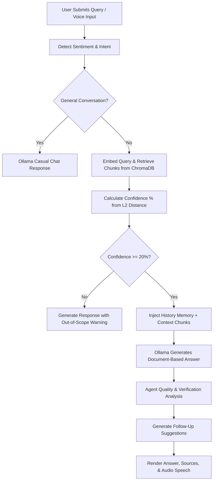

# 📚 Advanced RAG PDF Chatbot with AI Agent Memory & Voice Interface

An enterprise-ready, locally hosted Retrieval-Augmented Generation (RAG) PDF Chatbot built with **Streamlit**, **ChromaDB**, and **Ollama**. The system features a multi-role authentication system (Admin, Manager, User), custom AI agent memory, sentiment analysis, real-time voice recognition/text-to-speech, and automated response quality analysis.

---

## 🚀 Key Features

*   **🔒 Multi-Role Security & Auth:** User access control supporting **Admin**, **Manager**, and **User** roles. Includes password hashing, JWT session verification, account locking after failed attempts, and security audit logging.
*   **🧠 Cognitive Agent Memory:** Tracks short-term conversations, long-term topics, builds a verified fact cache, and learns query patterns dynamically to customize interactions.
*   **🎤 Voice & Speech Interface:** Integrated Voice Command Processor with speech-to-text (Vosk/SpeechRecognition) and text-to-speech (pyttsx3/gTTS) to read answers aloud and accept speech queries.
*   **⚡ Local RAG Pipeline:** Zero-cloud dependency. Uses SentenceTransformers (`all-MiniLM-L6-v2`) for fast vector embeddings and ChromaDB as a local persistent store. Integrates with Ollama (`llama3.1`) for local LLM text generation.
*   **📉 Smart Out-of-Scope Softening:** Computes similarity/relevance percentages. If a query falls outside document context, it seamlessly falls back to casual assistant mode with a gentle note, preventing hallucination.
*   **📊 Response Quality Analyzer:** Analyzes length, structure, clarity, and completeness metrics against source documents in real-time, providing feedback on response confidence.
*   **💬 Modern Chat Manager:** Automatically renames chats based on first query topics, lists history in the sidebar, extracts key hashtags/topics, and suggests follow-up questions.

---

## 🛠️ Technology Stack

| Component | Technology | Description |
| :--- | :--- | :--- |
| **Front-End & UI** | [Streamlit](https://streamlit.io/) | High-performance Python web framework for data applications. |
| **LLM Orchestration** | [Ollama](https://ollama.com/) | Local server hosting open models like `llama3.1` (default) or `llama3`. |
| **Vector DB** | [ChromaDB](https://www.trychroma.com/) | Persistent local vector database to store document chunks and embeddings. |
| **Embeddings** | [SentenceTransformers](https://sbert.net/) | `all-MiniLM-L6-v2` maps paragraphs into dense 384-dimensional vector spaces. |
| **Document Processing** | [PyMuPDF (fitz)](https://pymupdf.readthedocs.io/) | Fast PDF parser for structural text extraction (fallback: `PyPDF2`). |
| **Voice / TTS** | `pyttsx3` & `gTTS` | Speech generation; playback supported via `pygame.mixer`. |
| **Speech-to-Text** | `speechrecognition` & `Vosk` | Local offline voice command interpretation. |
| **Security** | `pyjwt` & `cryptography` | JWT validation, password hashing, and user role separation. |

---

## 🔄 System Architecture & Flow

### 1. Document Ingestion Pipeline (Admin Portal)


### 2. Retrieval & Query Flow (User Interface)


---

## 📂 Project Directory Structure

```text
Rag-Pdf-ChatBot/
│
├── llama/                         # Main source code directory
│   ├── main.py                    # Streamlit entry point & page router
│   ├── core_rag.py                # RAG engine (ChromaDB query, Ollama client, Sentiment analysis)
│   ├── auth.py                    # Authentication & Manager User Portal UI
│   ├── admin_ops.py               # Admin PDF management & chunk viewer UI
│   ├── utils.py                   # Chat History, Voice/TTS, Agent Memory & Response Analyzer
│   ├── diag.py                    # Standalone lightweight ChromaDB RAG tester
│   └── inspect_chunks.py          # Command-line utility to query/inspect ChromaDB chunks
│
├── data/                          # Persistent data directory (auto-created)
│   ├── chroma_db_fixed/           # ChromaDB database folders
│   ├── chat_history/              # User chats categorized by username
│   ├── uploaded_pdfs/             # Archive of processed PDFs
│   ├── users.json                 # Credentials database (SHA-256 hashed)
│   ├── current_session.json       # JWT backup tracking active session
│   ├── failed_attempts.json       # Lockout state tracker
│   └── audit.log                  # Append-only security log file
│
├── requirements.txt               # Complete Python packages index
├── FUNCTION_DOCUMENTATION.md      # Inline documentation detailing file sub-methods
└── README.md                      # Project manual and architecture guide
```

---

## ⚙️ Prerequisites & Installation

### Step 1: Clone and Set Up Environment
Ensure you have Python 3.10+ installed.
```bash
# Clone the repository
cd Rag-Pdf-ChatBot

# Create a virtual environment (pcr is the default gitignored folder)
python -m venv pcr

# Activate the environment
# On Windows:
pcr\Scripts\activate
# On Linux/macOS:
source pcr/bin/activate

# Install dependencies
pip install -r requirements.txt
```

### Step 2: Install and Start Ollama
1. Download Ollama from [ollama.com](https://ollama.com).
2. Start the Ollama background daemon.
3. Pull the required llama model:
   ```bash
   ollama pull llama3.1
   ```

### Step 3: Run the Application
Start the Streamlit application using:
```bash
streamlit run llama/main.py
```

---

## 👥 Access Portals & Default Credentials

When first run, `auth.py` automatically initializes default credentials inside `data/users.json`. 

| Account Role | Default Username | Default Password | Features Available |
| :--- | :--- | :--- | :--- |
| **Admin** | `admin` | `admin123!` | Document upload, processing, deletion, chunk-level DB viewer, system telemetry, and user logs. |
| **Manager** | `manager` | `manager123!` | Add/delete users, update access roles, and view login telemetry statistics. |
| **User** | `user1` | `user123!` | Conversational document querying, audio speaker controls, and chat history. |

---

## 🛡️ Security & Auditing

All key authentication events (logins, session validations, failed attempts, and new user creation) write directly to the `data/audit.log` format:
```text
2026-06-03 09:30:15 - security - login_success - User 'admin' logged in successfully
2026-06-03 09:32:00 - security - pdf_processed - User 'admin' parsed document 'Financial_Report.pdf'
```
Accounts will automatically lock temporarily if they exceed 5 failed password attempts to mitigate brute-force entries.
